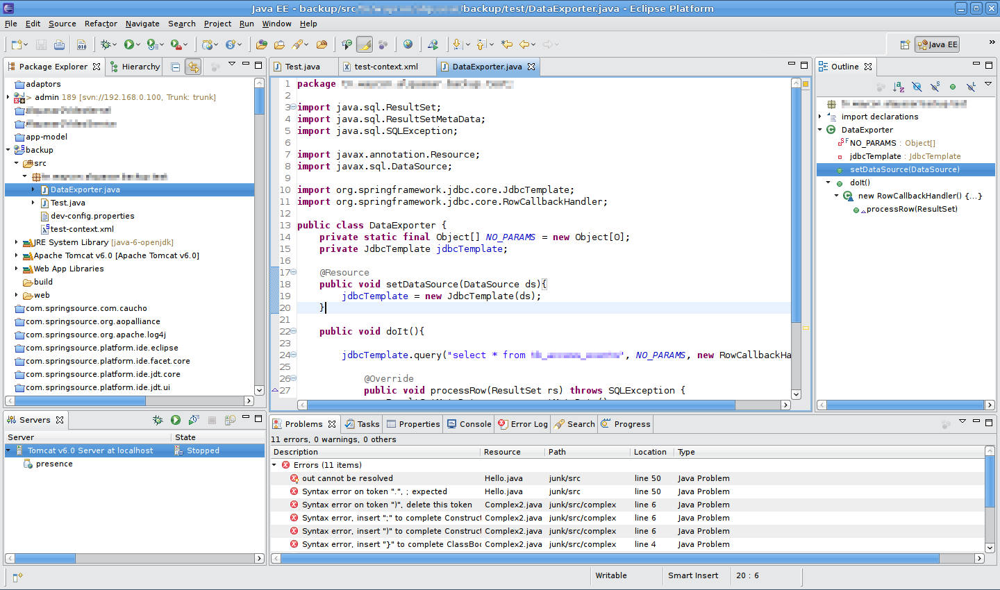
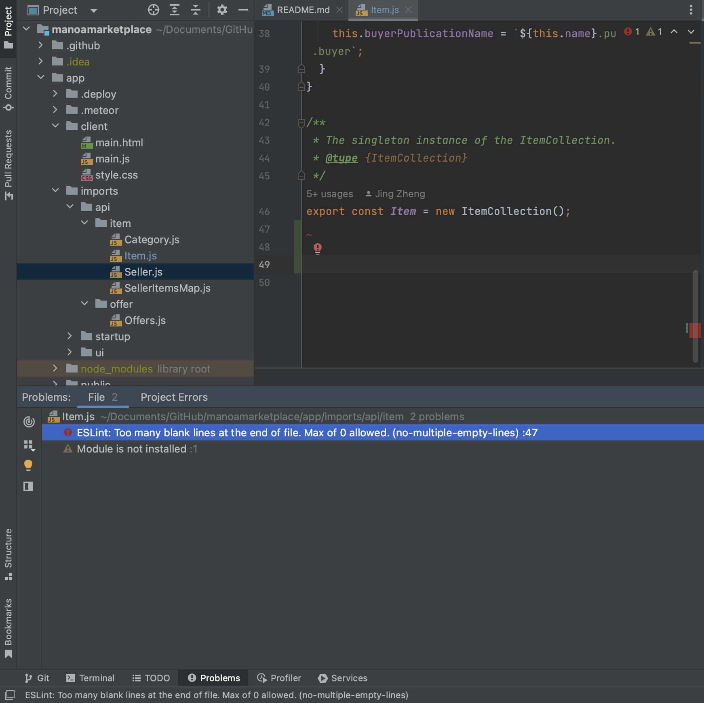

## This Is NOT the End

*IDE*

While studying the C language, the professor who was teaching the course highly suggested we use vim for writing, editing, and compiling our code. This was not an easy feat; I had gotten accustomed to the ease of use that IDEs offered. I was frustrated a lot in the beginning. I found myself stumbling over having to continuously switch between insert and command mode to traverse the file or edit it. Although the commands eventually came in handy, it took a significant amount of time to memorize them. Then I had to force myself to practice them so that the act would be second-nature. When it got overwhelming, I'd switch to the TextEdit application to give my brain a break. Unfortunately, the compilation step had no such shortcuts. First, the file containing the source code has to be compiled with the gcc compiler. If no errors are detected, an object file is created and from that, an executable. I'm making it sound like a lengthy process when really, this can be done in one line. I'd still argue that the process is longer when other options allow you to perform the compilation in the click of a button. 

