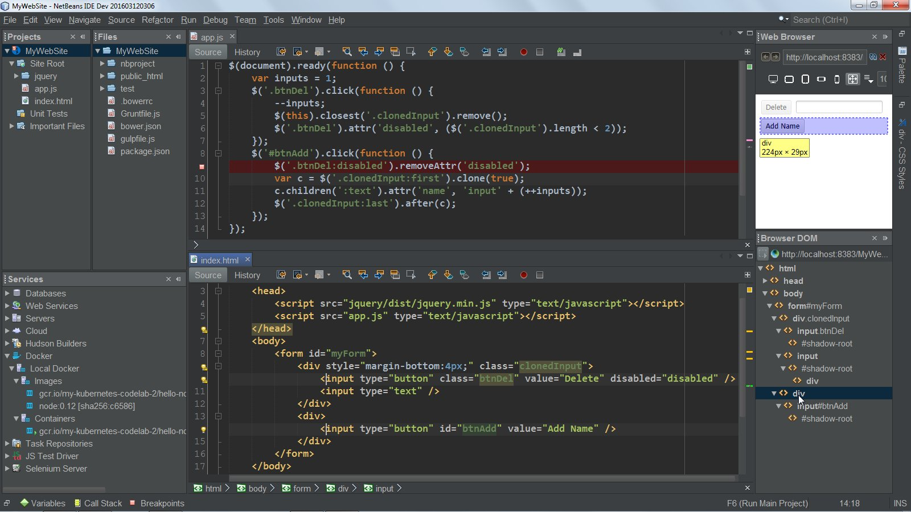

 
Software Engineers are aptly called that because in conjunction with their technical expertise, they implement engineering principles to perform an array of tasks. They are usually responsible for the the development, testing, and maintenance of software applications. While these tasks all pertain to software applications, each one requires a specific skill set. For example, a software engineer must be able to write and test their code. They must possess good communication skills in order to collaborate effectively with fellow engineers, developers, data scientists, and even clients or stakeholders. They must take in data to make informed decisions towards optimizing software. These can come in forms of software updates or bug fix releases. At this point, we can conclude that software engineers are probably a very stressed group of people. Thankfully, there are a myriad of tools and practices that software engineers can pick up to help them succeed.
 
### Hey, Siri. Fix my code.

Proficiency in **Integrated Development Environments (IDE)** is an invaluable skill that anyone working in the tech field should have. IDEs can compile and run your code, check for errors and fix them, perform refactoring, and many more. It serves like an assistant, dealing with the more trivial tasks of the job. These trivial tasks could accumulate to hundreds of working hours if not automated. This is especially true when working with large software systems. Guess who has large software systems? Companies you want to work for. The good news is that unless specified, programmers have free rein of what IDE to use. From personal experience, each IDE I familiarized myself with became quicker to learn because I was able to apply the knowledge I’ve acquired towards the next. They typically offer the same features, after all, only differing in the graphical interfaces.

  
   
  

